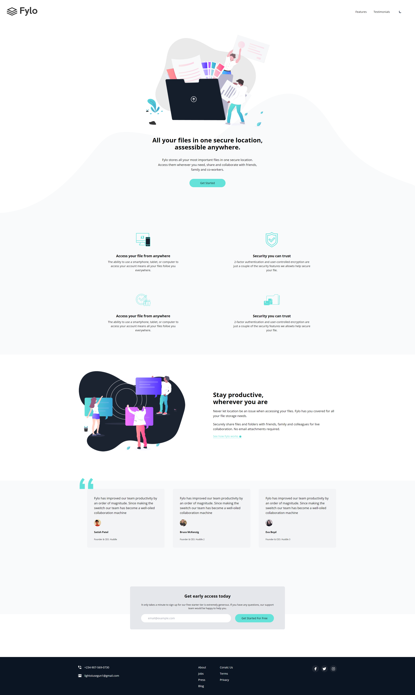

# Fylo Website

Fylo landing page with dark/light mode switcher from [Frontend Mentor Challenge](https://www.frontendmentor.io/challenges/loopstudios-landing-page-N88J5Onjw)

## Usage

Install dependencies

```
npm Install
```

Run Tailwind CLI in watch mode

```
npm run watch
```

To build onc, run
```
npm run build
```

## Dark Mode


## Light Mode


